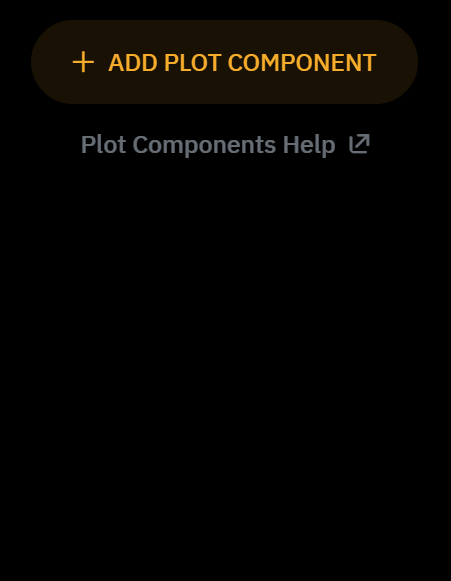
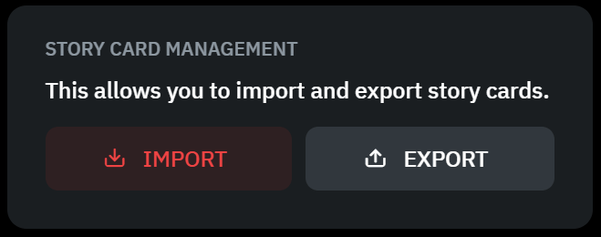
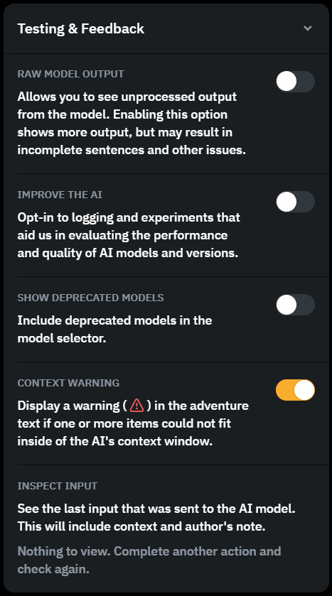
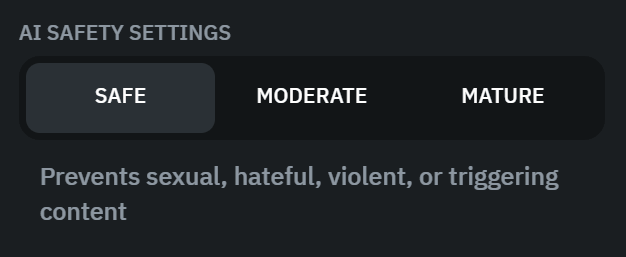
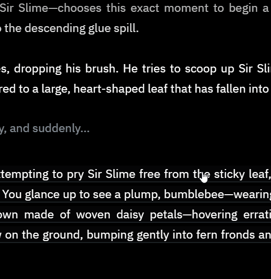

## Previews

Below are like smaller static previews of a couple UI elements, I just thought it might be helpful to see some of the UI without having to open the page.

### Plot Components

### Story Card Management

### Testing & Feedback

### AI Safety Settings

## Cropped GIFs

Below are the cropped versions of the GIFs which should look a bit better on smaller screens.

### Plot Components

### Memories

### Story Card Management

### Changing Name

### AI Safety Settings

### Testing & Feedback

### Third Person

